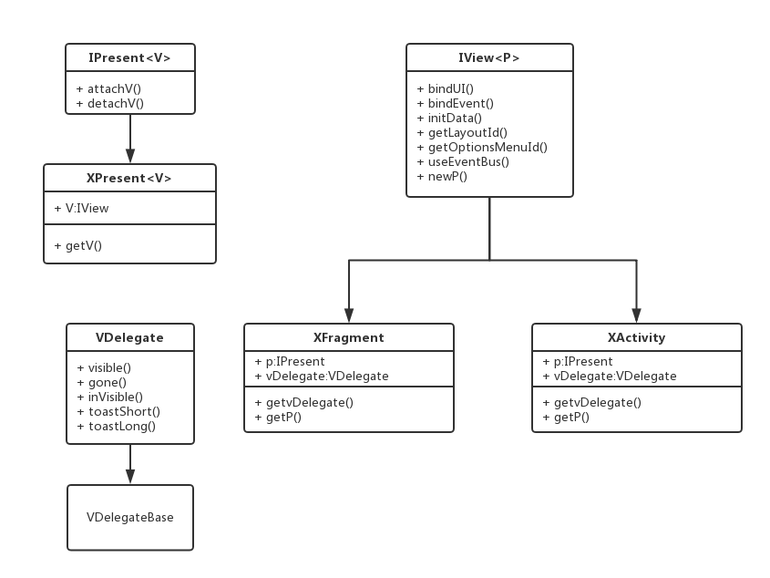

#XDroidMvp 轻量级的Android MVP快速开发框架

## 概述

<p align="center">
	
</p>

**XDroidMvp**是[XDroid](https://github.com/limedroid/XDroid)Android快速开发框架的MVP版本，其使用方式类似于`XDroid`，大部分源码也来自`XDroid`。

**XDroidMvp全新文档**：[https://github.com/limedroid/XDroidMvp/wiki](https://github.com/limedroid/XDroidMvp/wiki)

[](https://jitpack.io/#limedroid/XDroidMvp)

<p align="center">
	
</p>

`XDroidMvp`主要会有这些特性：

**无需写`Contract`！ 无需写`Present`接口！  无需写`View`接口!**

新增：

* Mvp实现
* `RxJava` & `RxAndroid`
* 权限适配 `RxPermission`
* 事件订阅默认采用 `RxBus`
* 网络交互：
	* `Retrofit` + `rx`
	* `Https`
	* **统一异常处理**
	* 缓存
	* **支持多个baseUrl**
	* 。。。。
* 无需担心rx内存泄漏
* 适配AndroidX，请前往`android-x`分支

保留：

* 提供`XActivity`、`XFragment`、`SimpleRecAdapter`、`SimpleListAdapter`等基类，可快速进行开发
* 完整封装`XRecyclerView`，可实现绝大部分需求
* `XStateController`、`XRecyclerContentLayout`实现loading、error、empty、content四种状态的自由切换
* 实现了`Memory`、`Disk`、`SharedPreferences`三种方式的缓存，可自由扩展
* 内置了`RxBus`，可自由切换到其他事件订阅库
* 内置`Glide`，可自由切换其他图片加载库
* 可输出漂亮的`Log`，支持`Json`、`Xml`、`Throwable`等，蝇量级实现
* 内置链式路由
* 内置常用工具类：`package`、`random`、`file`...,提供的都是非常常用的方法
* 内置加密工具类 `XCodec`，你想要的加密姿势都有


<p align="center">
	
</p>


**先睹为快**

你可以这么使用:

BasePagerFragment

```java
public abstract class BasePagerFragment extends XFragment<PBasePager>{

   @Override
    public void initData(Bundle savedInstanceState) {
        getP().loadData(getType(), 1);	//调用P方法
    }

   public void showData(int page, GankResults model) {
        if (page > 1) {
            getAdapter().addData(model.getResults());
        } else {
            getAdapter().setData(model.getResults());
        }

        contentLayout.getRecyclerView().setPage(page, MAX_PAGE);

        if (getAdapter().getItemCount() < 1) {
            contentLayout.showEmpty();
            return;
        }
    }
    
	 @Override
    public PBasePager newP() {
        return new PBasePager();
    }}
    
    @Override
    public int getLayoutId() {
        return R.layout.fragment_base_pager;
    }
```

PBasePager

```java
public class PBasePager extends XPresent<BasePagerFragment> {
    protected static final int PAGE_SIZE = 10;


    public void loadData(String type, final int page) {
        Api.getGankService().getGankData(type, PAGE_SIZE, page)
                .compose(XApi.<GankResults>getApiTransformer())
                .compose(XApi.<GankResults>getScheduler())
                .subscribe(new ApiSubcriber<GankResults>() {
                    @Override
                    protected void onFail(NetError error) {
                        getV().showError(error); //调用V方法
                    }

                    @Override
                    public void onNext(GankResults gankResults) {
                        getV().showData(page, gankResults);
                    }
                });
    }
}
```

## Get Started

使用，仅需四步：

### step1  

clone 'XDroid'库到本地:
```groovy
git clone https://github.com/limedroid/XDroidMvp.git
```

### step2

将`mvp`作为依赖库，在您的app module 中 添加如下依赖:
```groovy
compile project(':mvp')
```

### step3

拷贝`conf.gradle`到您的项目根目录，并修改项目gradle文件下引入：
```groovy
apply from: "conf.gradle"
```

并添加:

```groovy
allprojects {
    repositories {
        jcenter()
        maven { url "https://jitpack.io" }
    }
}
```

### step4

修改`XDroidConf`配置类，主要针对log、cache、router、imageloader。若采用默认配置，此步骤可略过.

## 第二种方式，通过JitPack引入

### step1 在根目录的gradle文件中配置:
```groovy
allprojects {
    repositories {
        jcenter()
        maven { url "https://jitpack.io" }
    }
}
```

### step2 添加依赖:
```groovy
dependencies {
	   implementation 'com.github.limedroid:XDroidMvp:v2.0.1'
}
```


## Demo效果

<p align="center">
	
</p>

<p align="center">
	
</p>


## 重要说明

* [ButterKnife](https://github.com/JakeWharton/butterknife)使用的是8.4.0版本，重点是 `@BindView`，可以去项目官网查看。
* [Rxlifecycle](https://github.com/trello/RxLifecycle)使用的是1.0版本，具体如何使用可以查看官网。
* [RxPermissions](https://github.com/tbruyelle/RxPermissions)使用的是0.9.1版本，具体如何使用可以查看官网。
* [retrofit](https://github.com/square/retrofit)，具体如何使用可以查看官网。

## 更新日志

* 2017-04-23，新增proguard rules,upgrade to rx2
* 2016-12-23，新增mvp、base、cache、event、imageloader、log、router
* 2016-12-25，新增rxJava、rxAndroid、rxlifecycle、rxpermission、rxbus、net(retrofit)
* 2016-12-26，新增网络异常统一处理
* 2016-12-28，重构MVP
* 2016-12-30，重构网络层
* 2016-12-31，新增[Demo](https://github.com/limedroid/XDroidMvp/tree/master/app)


## TODO

* [x] rx
* [x] retrofit
* [x] rxpermission
* [x] rxbus
* [x] cache
* [x] wiki
* [x] demo

## About Me

**Email** : droidlover@126.com

**XDroid交流群**：153569290

**XDroid MVC版本**：[XDroid](https://github.com/limedroid/XDroid)

若您在使用过程中遇到任何问题，欢迎加入 **153569290** 群或者是邮件反馈，谢谢您的关注。**XDroidMvp**会持续维护，如果喜欢，记得star fork。


